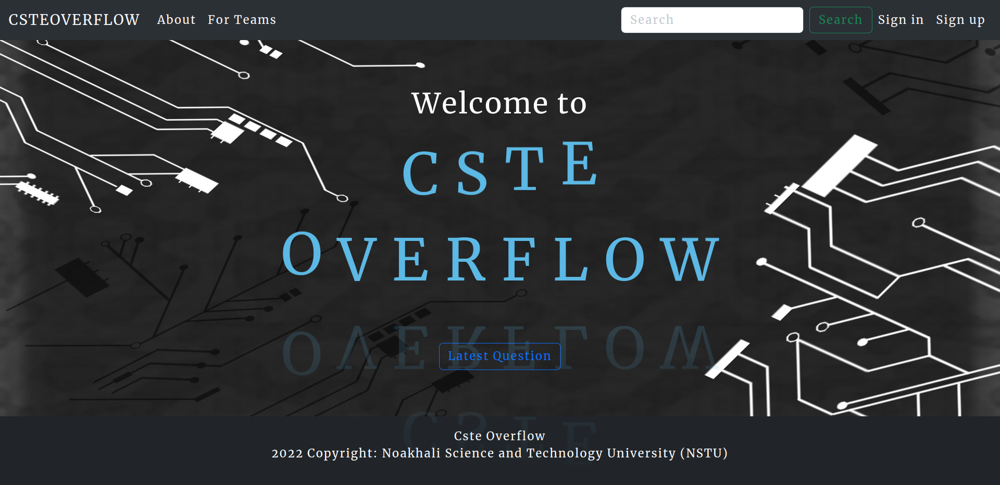
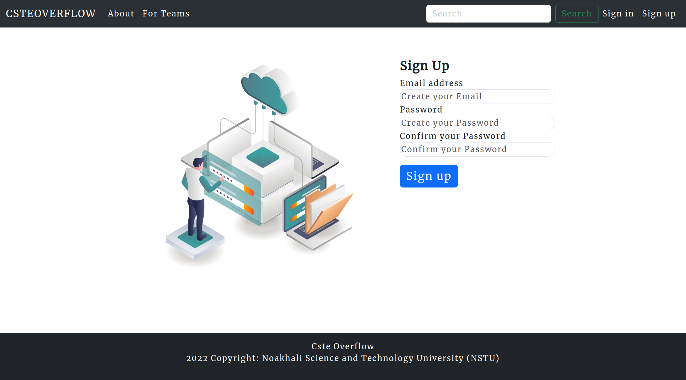
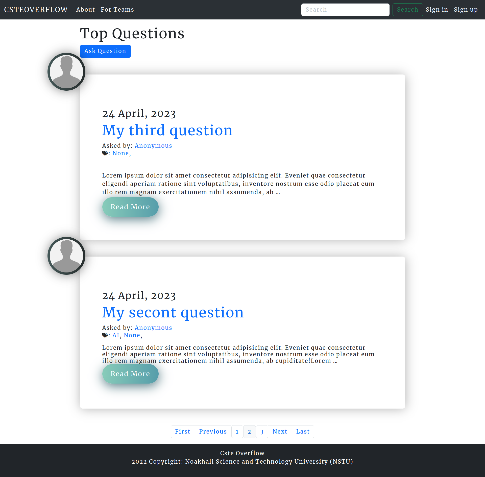
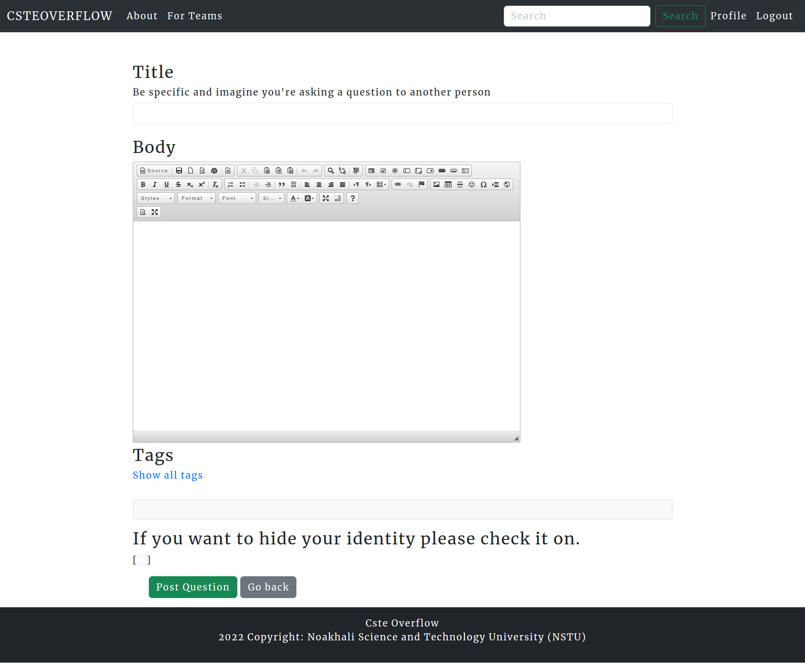
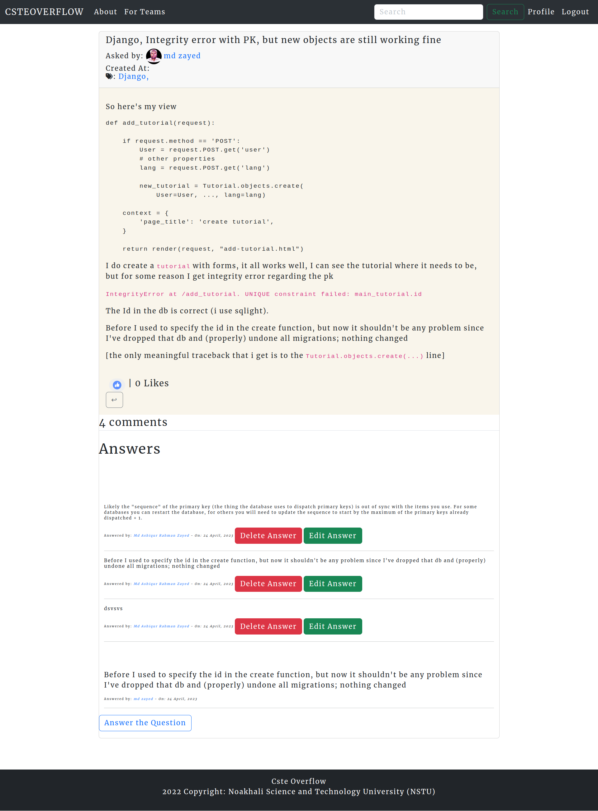
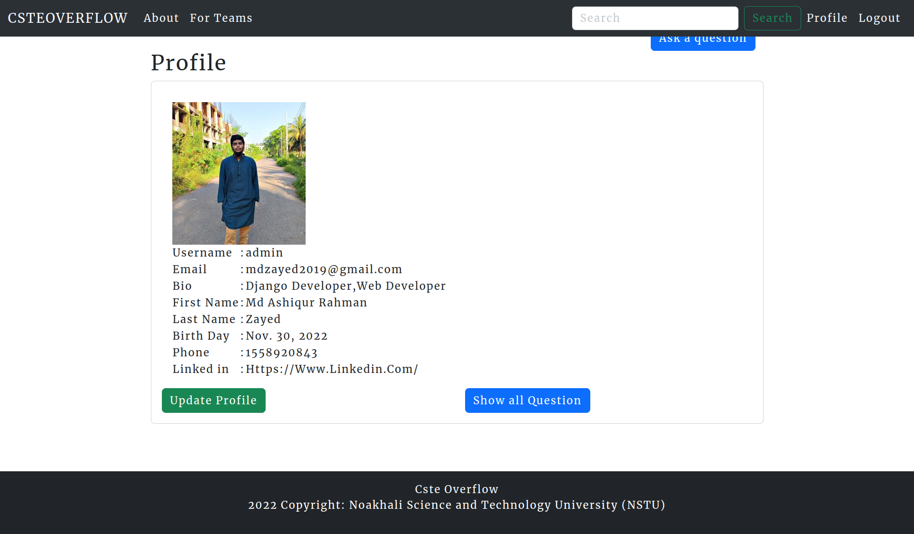

# CsteOverflow
"CsteOverflow" is a web-based platform that provides a platform for users to ask and answer
questions on various topics related to computer science and information technology. The project
is designed to be similar to StackOverflow, a popular question and answer platform, but with
additional features.
One of the primary features of CsteOverflow is the ability for users to post questions
anonymously. This allows users to ask sensitive or personal questions without revealing their
identity. The platform provides a safe and supportive community where users can seek help and
advice from experts in the field.
The project was developed using HTML, CSS, JavaScript, and Django, a popular web
development framework. The platform has a user-friendly interface and allows users to search
for relevant questions, answer questions, and like on the best answers.
In conclusion, CsteOverflow provides a valuable resource for computer science and IT
professionals to seek and provide help, share knowledge, and build their reputation within the
community. The addition of anonymous question posting adds an extra layer of privacy and
security to the platform, making it a trusted and reliable resource for users.


## Setup
The first thing to do is to clone the repository:


```sh
$ git clone https://github.com/MdAshiqurRahmanZayed/CsteOverflow.git
$ cd CsteOverflow
```
Create a virtual environment to install dependencies in and activate it:

```sh
$ python -m venv test
$ source test/bin/activate
```
Then install the dependencies:

```sh
(test)$ pip install -r requirements.txt
```
Once `pip` has finished downloading the dependencies:
```sh
(test)$ python manage.py runserver
```
And navigate to `http://127.0.0.1:8000/`
we have to migrate
```sh
$ python manage.py makemigrations 
$ python manage.py migrate 
$ python manage.py createsuperuser
$ python manage.py runserver
```

Demo Screenshots






